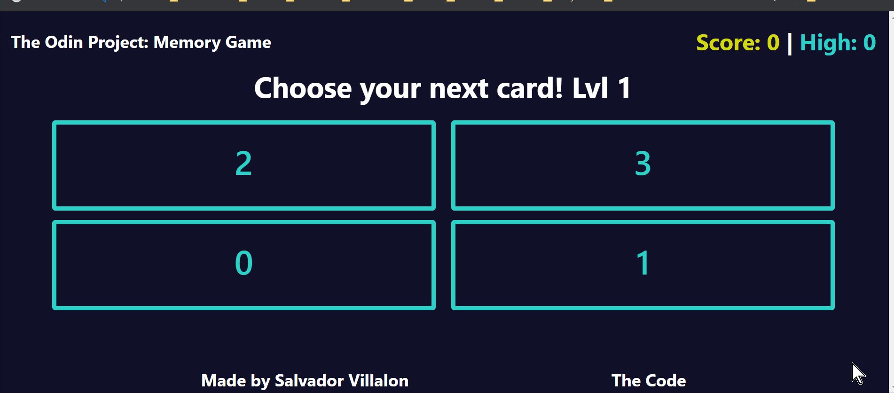

# Memory Card
[The Odin Project: Javascript] - Project: Memory Card

# Summary

-   This project was used as an introduction to React Hook and Lifecycle methods. Since I had some exposure to React, I pushed myself:

    -   To practice creating Reusable components.
    -   In using semantic tags since I wanted to start creating good accessibility habits
    -   Use Gatsby to get familiar with this framework
    -   Continue using Sass
    
- Project Task: [The Odin Project - Memory Card](https://www.theodinproject.com/lessons/memory-card)
- View Project: http://theodinproject_sv_memorygame.surge.sh/

### Demo


# Lessons Learned

0. I pushed myself to learn Gatsby! I heard of this framework and this has been my first exposure to it! It is great. I really like how it simplifies the Metadata of the website that allows it be configured easily. I know there are so many benefits to it. I will learn more about it.

1. Used Dribbel to get inspiration for the fonts and design of the web app. [Inspiration from Craftverse Website Design](https://dribbble.com/shots/15316438-Craftverse-Website-Design). This lead me to creating a style guide.

    - ## 📗 Fonts used

        - Segoe UI

    - ## 🎨 Color Reference	
    | Color            | Hex                                                                |
    | ---------------- | ------------------------------------------------------------------ |
    | Turquoise        |  `#2cd1c7` |
    | Black            |  `#111029` |
    | Yellow           |  `#d1da0e` |
    | Turquoise Hover  |  `#2fc2b9` |

2. I learned how useState replaces, it never merges. This explains why during my previous projects i had to do the following. I had to do it like this since if I did not include '...resumeData' it will just replace the data!

```jsx
setResumeData({
	...resumeData,
	resumeData[key]: value
})
```

3. I also learned the following about useEffect

    1. I learned that the **_effects_** take effect after each render. It is better to think of effects instead of mounting and updating
    2. When you leave the useEffect empty, it will only be run once. This is similar to componentDidMount

    ```jsx
    useEffect(() => {
    	// Do something
    }, []);
    ```

    3. If we add a dependency array, the effect inside useEffect will only be activated if there is a change in dependency changes. So this will be useful in the case the state changes or the prop changes

    ```jsx
    useEffect(() => {
    	// Do something
    }, [color]);
    ```

    4. If you leave out the dependency array, the effect will be activated everytime the component is updated. So after every render

    ```jsx
    Leave out the dependency array.
    useEffect(() => {
    // Do something
    });
    ```

# Technologies:

-   React
-   React Bootstrap
-   Dribble
-   Sass
-   Surge.sh
-   Gatsby
